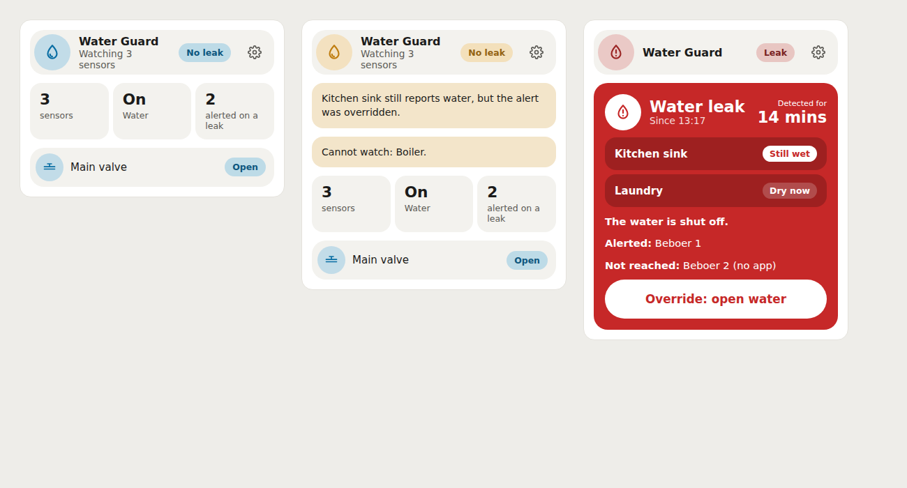
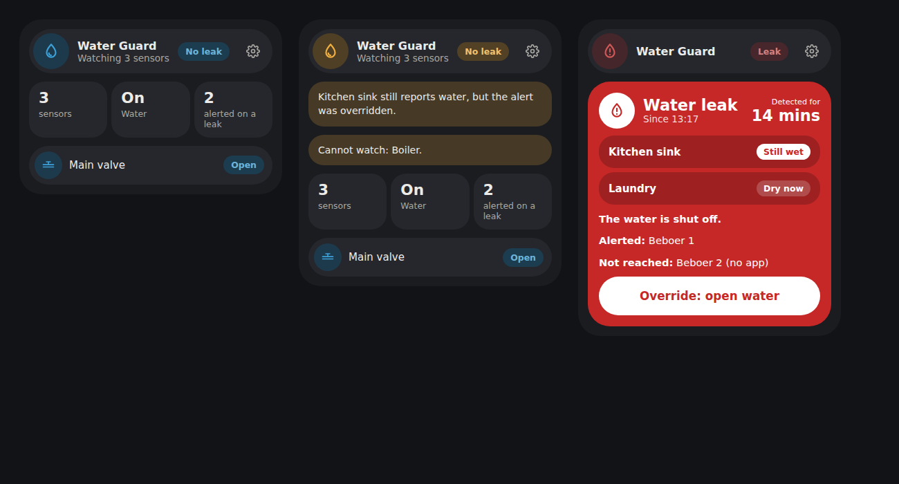
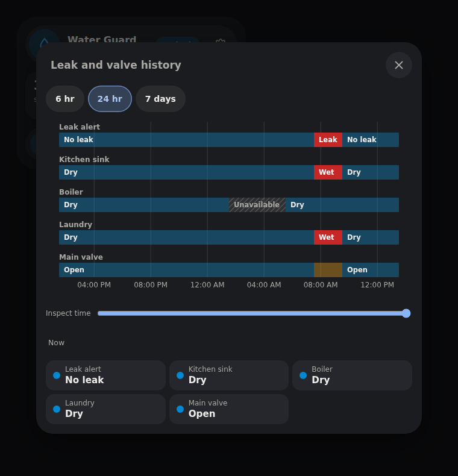

# Water Guard card

A Lovelace card for the [Water Guard](https://github.com/mvheimburg/water-guard)
integration. It shows a leak alert clearly and gives the household the one
action they need afterwards: **Override: open water**. English and Norwegian
Bokmål (*Vannvakt*).







The images use the production bundle with simulated Home Assistant states. No
live Home Assistant instance was involved.

## Requirements

- The [Water Guard](https://github.com/mvheimburg/water-guard) integration,
  **0.2.0 or later** for the full card. With 0.1.x, the card still shows the
  alert and the override, but it can only list valves and people after they
  have been used, and it says so.
- Installs through HACS as a **Dashboard** repository.

## Install

In HACS, open **Custom repositories**, add
`https://github.com/mvheimburg/lovelace-water-guard` as a **Dashboard**
repository, and install **Water Guard Card**. HACS normally adds the resource;
if not, add `/hacsfiles/lovelace-water-guard/water-guard-card.js` as a
JavaScript module under **Settings → Dashboards → Resources**.

## Card

```yaml
type: custom:water-guard-card
entity: binary_sensor.water_leak
title: Vannvakt
appearance: bubble
```

| Option | Default | Description |
| --- | --- | --- |
| `entity` | first Water Guard found | The Water Guard **Leak** binary sensor. One card per guarded water supply. |
| `title` | Water Guard / Vannvakt | Optional heading. |
| `appearance` | `default` | `default` or `bubble` (uses the dashboard's `--bubble-*` variables). |

The visual editor lists only Water Guard Leak sensors. Water Guard's own
settings — leak sensors, people, valves and whether it shuts the water off —
stay in the integration under **Settings → Devices & services → Water Guard →
Configure**. The card's settings cog links there.

## What it shows

**No leak.** How many sensors are watched, whether the water is on, how many
people are alerted on a leak, and each valve's position (a `switch` that drives
a valve counts as open when on). It also says when a sensor still reports water
after an override, and when a sensor cannot be watched because it is
unavailable.

**Leak.** The card turns red: when the leak was detected and for how long, each
sensor that fired and whether it is still wet, whether the water is shut off —
or which valve is still open — and who was alerted, who was not reached
(for example *no app*), and who is still being alerted.

**Override: open water** opens a confirmation that names the valves it will
open and warns when a sensor still reports water. Confirming calls
`water_guard.override` on the Leak sensor. While Water Guard opens the valves the
button shows *Opening the water…* and cannot be pressed again. If a valve does
not open, Water Guard keeps the alert and the card shows the error and the valve
that failed. The card never assumes the result; it waits for Water Guard's
state. If the alert changes while the confirmation is open, confirming is
refused and you are asked to review it again.

When Water Guard is unavailable, the card says so and the override is disabled.
The settings link stays available.

## History

Tap the status in the header (*No leak* / *Leak*), the **sensors** or
**Water** tile, a valve, or a sensor listed in a leak alert to open the
**Leak and valve history** of this guarded supply. It is a timeline from Home
Assistant's recorder with one lane each for Water Guard's leak alert, every
leak sensor and every valve:

| Lane | States and colors |
| --- | --- |
| Leak alert | *No leak* (blue), *Leak* (red) |
| Leak sensor | *Dry* (blue), *Wet* (red) |
| Valve | *Open* (blue), *Closed* (amber), *Opening* / *Closing* (grey-blue) |

An unavailable spell is a hatched grey gap; before the first recorded state the
lane is empty. Choose **6 h**, **24 h** or **7 d** (*6 t / 24 t / 7 d* in
Bokmål). Move the pointer, or drag a finger, along the timeline to read every
lane's state at that moment; the time is shown under the timeline, and without
a pointer the states are the current ones. Each lane in the legend below opens
that entity's details (more-info). The *alerted on a leak* count is not a
sensor reading and does not open a history.

The card reads the recorder with the `history/history_during_period` websocket
command, so the entities need to be recorded (the default).

## Language and formatting

The card follows Home Assistant's language (`nb`, `nb-NO` and `no` give Bokmål;
`nn` uses Bokmål too; anything else English) and updates when it changes. Times
use Home Assistant's formatting locale and 12/24-hour preference separately, so
English with `en-GB` keeps a 24-hour clock. Sensor, valve and person names are
shown as Home Assistant names them. The card-picker entry is English because it
has no Home Assistant context.

## Development

```sh
npm ci
npx playwright install chromium
npm test
npm run lint
npm run typecheck
npm run build
node scripts/screenshot.cjs
```

`dist/` is committed and must match the build. Pushing a new `package.json`
version to `main` tags `v<version>` and publishes a release.

## License

MIT

## Color schemes

Choose **Color scheme** in the card's visual editor. The setting is per card and
works with both **Default** and **Bubble** appearance, including in-card dialogs.
Every card supplied by this package offers the same choices:

| Scheme | YAML value | Palette |
| --- | --- | --- |
| Home Assistant (default) | `home-assistant` | Follows your dashboard theme and Bubble color variables |
| Bright | `bright` | White surfaces with blue accents |
| Warm | `warm` | Ivory surfaces with warm brown accents |
| Mint | `mint` | Pale green surfaces with green accents |
| Sky | `sky` | Pale blue surfaces with blue accents |
| Lavender | `lavender` | Pale purple surfaces with purple accents |

For example, add these options to your existing card configuration:

```yaml
appearance: bubble
color_scheme: mint
```

The five light schemes stay light even on a dark dashboard and override inherited
colors only within this card. Status colors retain their meaning (green for
success, amber for warnings and red for errors). Remove `color_scheme` or choose
**Home Assistant** to follow the dashboard again. Existing configurations keep
their current appearance. Scheme names and the editor label support English and
Norwegian Bokmål; YAML values remain unchanged in either language. Static
card-picker metadata remains English because it has no Home Assistant language
context.

History uses the bundled `lovelace-card-history` library; no additional Lovelace
resource is needed. Its recorder dialog offers 6 h, 24 h and 7 d, pointer
readouts, localized labels, gaps for unavailable states and entity details from
the legend. Failed requests offer **Try again**; closing returns keyboard focus
to the reading that opened it.
